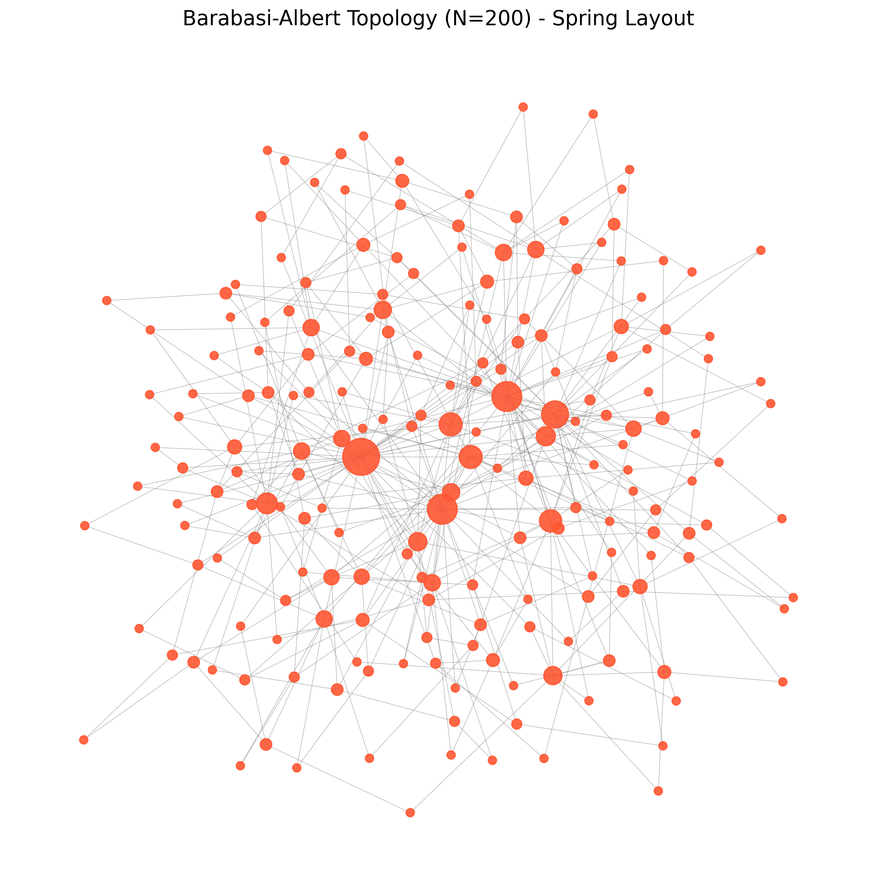

## Models

### Graph Models

### Barabási-Albert (BA)

Networks with a clear hierarchy or centralized data flow, where some nodes are far more important than others (hubs).
When a new node joins the network, it's much more likely to connect to nodes that already have many connections. This creates a "hub-and-spoke" structure.

#### Use Cases

- Hierarchical Architectures: The logical topology of many IoT systems, where thousands of simple sensors report to a few powerful gateways, which in turn report to a single cloud server. The gateways and server are the hubs.
- Industrial IoT: A factory floor where many machines and sensors are all monitored and controlled by a central Programmable Logic Controller (PLC) or SCADA system.
- Supply Chain Networks: An RFID tracking system where goods move through major distribution centers (hubs).

#### Example of the model:

### Watts-Strogatz (WS)

Networks with high local clustering and a few "shortcut" connections that provide global efficiency.
Most nodes are only connected to their immediate neighbors, but a few random long-range links connect distant clusters, making the whole network navigable in just a few hops.

#### Use Cases

- Smart Building Automation: Sensors in one room are all tightly connected to a local controller, but the main building controller provides a "shortcut" link between different rooms or floors.
- Utility Grids: Sections of a power grid are locally very interconnected, but a few high-voltage transmission lines act as shortcuts to link different regions.

#### Example of the model:

### Erdős-Rényi (ER)

A theoretical baseline or null model for comparison. It's the purest form of a random network with no underlying structural rules.
For every possible pair of nodes, flip a coin to decide if they should be connected. There is no preference for geography, hubs, or clusters.

#### Use Cases

- As a Control Group: Its primary use is to prove that a feature you observe in another model (like the high resilience of BA to random failures) is due to its specific structure and not just random luck.
- Peer-to-Peer (P2P) Overlays: Some simple P2P systems in IoT might establish connections randomly, making the ER model a reasonable, if simplistic, approximation of their logical connections.

#### Example of the model:

### Random Geometric Graph (RGG)

Wireless networks where connectivity is determined by physical proximity. Nodes are randomly scattered in a physical space.
A connection exists only if two nodes are within a certain communication radius of each other.

#### Use Cases

- Wireless Sensor Networks: Environmental monitoring sensors spread across a field or forest.
- Vehicular Networks (VANETs): Cars on a highway that can communicate with other nearby cars.
- Mobile Robot Swarms: A group of autonomous robots coordinating in a warehouse.

#### Example of the model:

### Hierarchical Model

Networks that are explicitly designed with a multi-level, tiered structure. This model is distinct from others as it doesn't rely on random chance or emergent rules but on a deliberate, engineered topology.
The model creates distinct layers, such as a central 'sink' node (Level 0), several 'gateway' nodes (Level 1),
and a large number of 'sensor' nodes (Level 2). Each sensor reports only to its parent gateway, and gateways report to the central sink, creating a clear, tree-like data flow.

#### Use Cases

- Smart City Deployments: Sensors for traffic, air quality, and waste management are deployed in neighborhoods. They report to local gateways, which then transmit aggregated data to a central city operations center (the sink).
- Precision Agriculture: Sensors across a large farm are grouped into zones. Each zone's sensors report to a gateway that controls irrigation for that area, and all gateways are managed by a central farm server.
- Building Management Systems: HVAC, lighting, and security sensors on each floor report to a floor-level controller (gateway), and all floor controllers are connected to the main building management server.

#### Example of the model:

