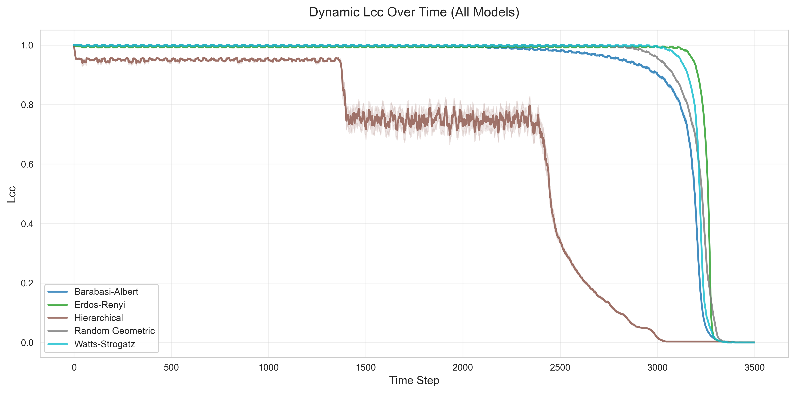
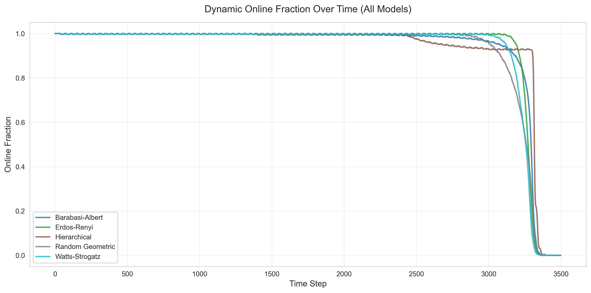
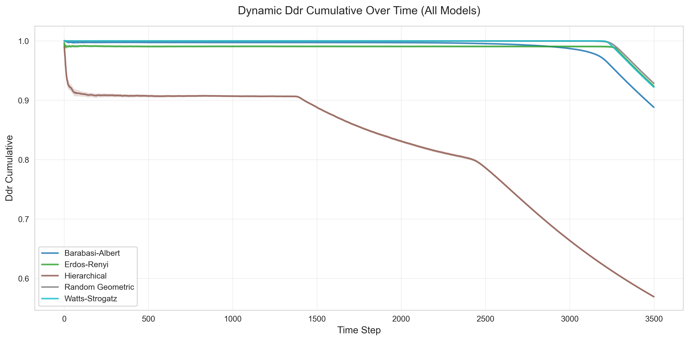
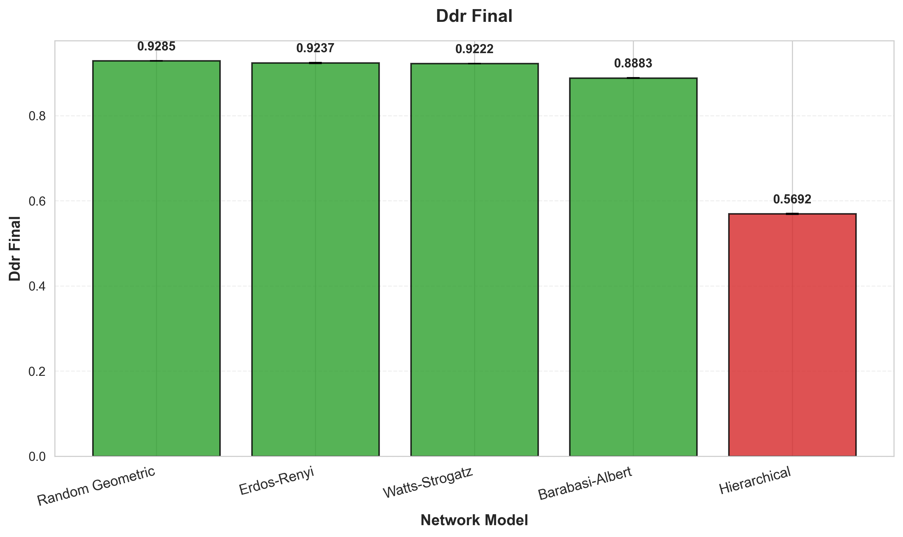
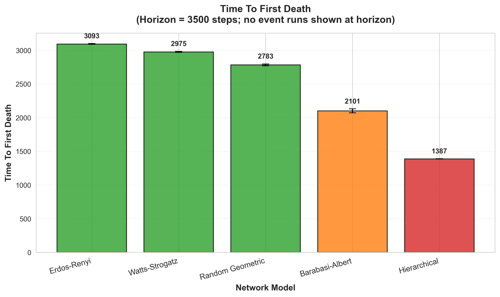
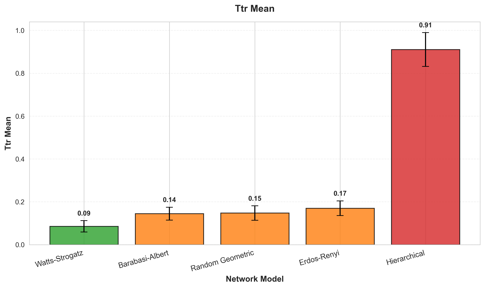
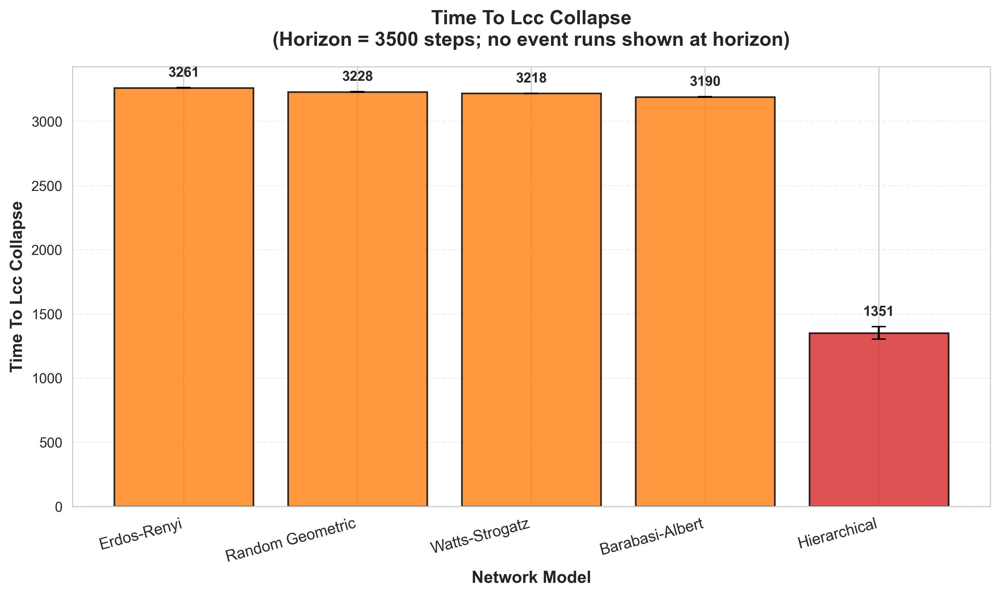

# Static Resilience Analysis: Results

## Plots

---

### Quantitative Resilience Metrics

**Time to 50% LCC Loss (Targeted Degree Attack):**

| Network Model | Nodes to 50% Loss | % of Total Nodes |
| :--- | :--- | :--- |
| Hierarchical | 10 | 3.3% |
| Barabási-Albert | 18 | 6% |
| Watts-Strogatz | 52 | 17% |
| Random Geometric | 48 | 16% |
| Erdős-Rényi | 95 | 32% |

**Vulnerability Index** (lower = more resilient):

| Network Model | Vulnerability Index |
| :--- | :--- |
| Hierarchical | 0.033 |
| Barabási-Albert | 0.060 |
| Watts-Strogatz | 0.173 |
| Random Geometric | 0.160 |
| Erdős-Rényi | 0.317 |

---

## Findings

### Barabási-Albert & Hierarchical Networks

- Observation: Targeted Degree and Targeted Centrality attacks are nearly identical and cause rapid collapse.
- Interpretation: Hubs/gateways are also key bridges; both strategies target the same critical nodes.

### Erdős-Rényi Network

- Observation: All three strategies behave similarly.
- Interpretation: The network is homogeneous; intelligent targeting offers little advantage.

### Watts-Strogatz & Random Geometric Networks

- Observation: Centrality-based attacks are most damaging, then degree-based, then random.
- Interpretation: High-centrality nodes form shortcuts/bridges across clusters or geographic regions.

---

> [!NOTE]
>
> Below we can view the summary table as a conclusion to the static analysis experiment.
>
> ### Summary Table
>
> | Network Model | Resilience to Random Failures | Most Effective Targeted Attack | Key Structural Reason |
> | :--- | :--- | :--- | :--- |
> | Hierarchical | Very High | Degree / Centrality (Identical) | Centralized single points of failure. |
> | Barabási-Albert | High | Degree / Centrality (Identical) | Hubs are also the main bridges. |
> | Watts-Strogatz | Moderate | Centrality | Attacks the critical "shortcut" nodes between clusters. |
> | Random Geometric | Moderate | Centrality | Attacks the critical "bridge" nodes between geographic regions. |
> | Erdős-Rényi | Moderate | (Similar) | Lacks exploitable structure. |
>

# Dynamic Resilience Analysis: Results

## Plots

---

### Performance Metrics Summary (3500 Steps with Energy Depletion)

**Data Delivery Ratio (Final DDR after energy depletion):**

| Network Model | Avg DDR | Performance |
| :--- | :--- | :--- |
| Random Geometric | 0.9285 | Excellent ⭐⭐⭐⭐⭐ |
| Erdős-Rényi | 0.9237 | Excellent ⭐⭐⭐⭐⭐ |
| Watts-Strogatz | 0.9222 | Excellent ⭐⭐⭐⭐⭐ |
| Barabási-Albert | 0.8883 | Good ⭐⭐⭐⭐ |
| Hierarchical | 0.5692 | Poor ⭐⭐ |

**Energy Lifetime & Resilience:**

| Network Model | Time to First Death (steps) | LCC Collapses | Final Online Fraction |
| :--- | :--- | :--- | :--- |
| Erdős-Rényi | 3094 | 150/150 (100%) | ~0% |
| Watts-Strogatz | 2976 | 150/150 (100%) | ~0% |
| Random Geometric | 2783 | 150/150 (100%) | ~0% |
| Barabási-Albert | 2101 ⚠️ | 150/150 (100%) | ~0% |
| Hierarchical | 1388 ⚠️ | 150/150 (100%) | ~0% |

---

## Findings: Energy Depletion & Network Degradation

### Energy Lifetime Rankings

**Key Observation:** Different topologies exhibit dramatically different energy consumption patterns:

1. **Erdős-Rényi (3094 steps)** - Longest survival due to uniform load distribution
2. **Watts-Strogatz (2976 steps)** - Balanced traffic via clustering + shortcuts
3. **Random Geometric (2783 steps)** - Good load balancing with spatial routing
4. **Barabási-Albert (2101 steps)** - Hub nodes die early from high traffic load
5. **Hierarchical (1388 steps)** - Gateways exhaust energy first (all sensor traffic)

### Network-Specific Analysis

**Random Geometric, Erdős-Rényi & Watts-Strogatz:**

- **Observation:** Maintain 92-93% DDR throughout 3500 steps. Graceful degradation as nodes die.
- **Energy Depletion:** Uniform death patterns (~3000 steps). Networks remain partially connected until near-total collapse.
- **Interpretation:** Distributed topologies balance energy load. Multiple redundant paths compensate for node failures.

**Barabási-Albert:**

- **Observation:** Earlier first deaths (2101 steps). DDR drops to 88.8%, showing stress under energy constraints.
- **Energy Depletion:** Hub nodes die first due to forwarding traffic for many peripheral nodes.
- **Interpretation:** Scale-free networks are vulnerable to energy-based "targeted" attacks. High-degree nodes exhaust energy faster, creating cascading failures.

**Hierarchical:**

- **Observation:** Catastrophic performance. First deaths at 1388 steps. Final DDR only 56.9%.
- **Energy Depletion:** Gateway nodes die first (all sensor traffic flows through them). 100% LCC collapse rate.
- **Interpretation:** Centralized architecture creates extreme energy hotspots. Gateway failures instantly partition the network, isolating sensor clusters.

---

> [!NOTE]
>
> ### Overall Performance Summary
>
> | Network Model | DDR (3500 steps) | Energy Lifetime | Resilience to Targeted Attacks | Key Characteristic |
> | :--- | :--- | :--- | :--- | :--- |
> | Random Geometric | 92.9% | 2783 steps | Moderate | Spatial redundancy, graceful degradation |
> | Erdős-Rényi | 92.4% | 3094 steps | Moderate | Uniform load distribution, longest survival |
> | Watts-Strogatz | 92.2% | 2976 steps | Moderate | Clustering + shortcuts, balanced traffic |
> | Barabási-Albert | 88.8% | 2101 steps ⚠️ | Poor | Hub energy exhaustion, scale-free vulnerability |
> | Hierarchical | 56.9% | 1388 steps ⚠️ | Extremely Poor | Gateway dependency, catastrophic failures |
>

---

### Critical Insights

#### 1. Energy-Based "Targeted Attacks" Emerge Naturally

- **Hub-based topologies** (BA, Hierarchical) suffer from natural load concentration
- High-degree nodes exhaust energy faster, creating cascading failures
- Energy depletion reveals hidden vulnerabilities not visible in static analysis

#### 2. Distributed Topologies Win on Energy Efficiency

- ER, WS, RGG maintain 92%+ DDR even after 3500 steps
- Uniform load distribution extends network lifetime by 40-120% vs. hierarchical
- Multiple redundant paths enable graceful degradation

#### 3. Hierarchical Networks Face Dual Vulnerabilities

- **Energy hotspots:** Gateways die 2.2× faster than distributed networks
- **Structural brittleness:** Single gateway failure partitions 14+ sensors
- **Recommendation:** Add gateway redundancy, multi-parent sensors, inter-gateway mesh

#### 4. Barabási-Albert: Random-Resilient but Energy-Vulnerable

- **Static analysis:** Poor under targeted attacks (6% removal → 50% LCC loss)
- **Dynamic analysis:** Good under random failures, but hub energy exhaustion emerges
- **Trade-off:** Natural load imbalance creates energy-based "targeted" effects

---

### Comparison: Static vs. Dynamic Analysis

| Network Model | Random Failures (Dynamic) | Energy Lifetime | Targeted Attacks (Static) | Recommendation |
|---------------|---------------------------|-----------------|---------------------------|----------------|
| Erdős-Rényi | Excellent (DDR=92.4%) | 3094 steps (best) | Moderate (32% removal → 50% loss) | ✅ Best overall balance |
| Watts-Strogatz | Excellent (DDR=92.2%) | 2976 steps | Moderate (17% removal → 50% loss) | ✅ Best for high-reliability IoT |
| Random Geometric | Excellent (DDR=92.9%) | 2783 steps | Moderate (16% removal → 50% loss) | ✅ Best for spatial networks |
| Barabási-Albert | Good (DDR=88.8%) | 2101 steps ⚠️ | Poor (6% removal → 50% loss) | ⚠️ Avoid for critical/long-lived systems |
| Hierarchical | Poor (DDR=56.9%) | 1388 steps ⚠️ | Extremely Poor (3.3% removal → 50% loss) | ❌ Requires major architectural changes |
