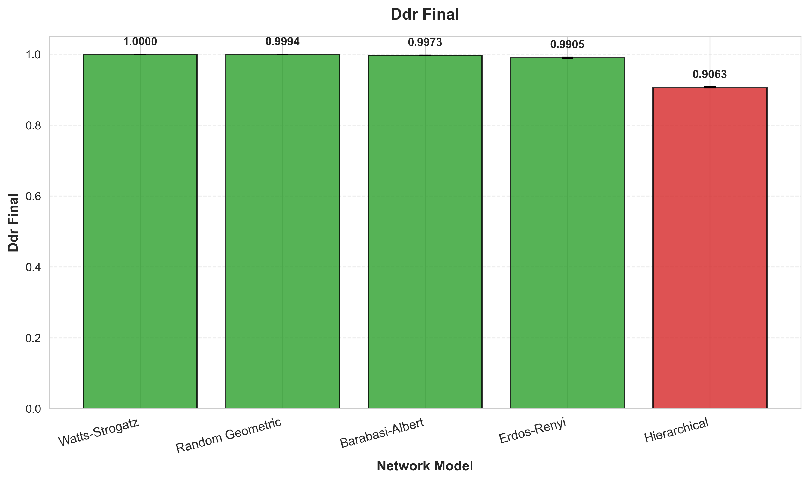
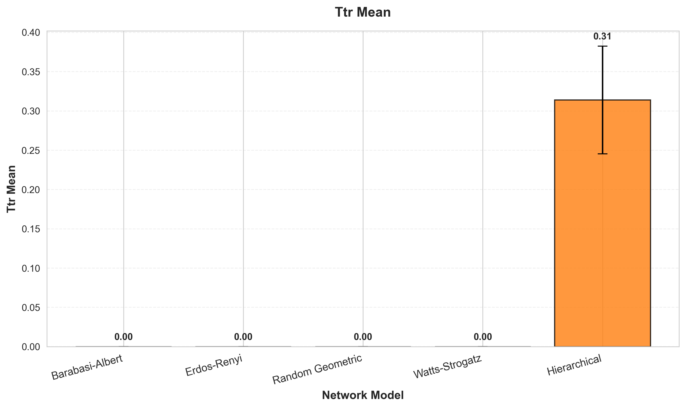
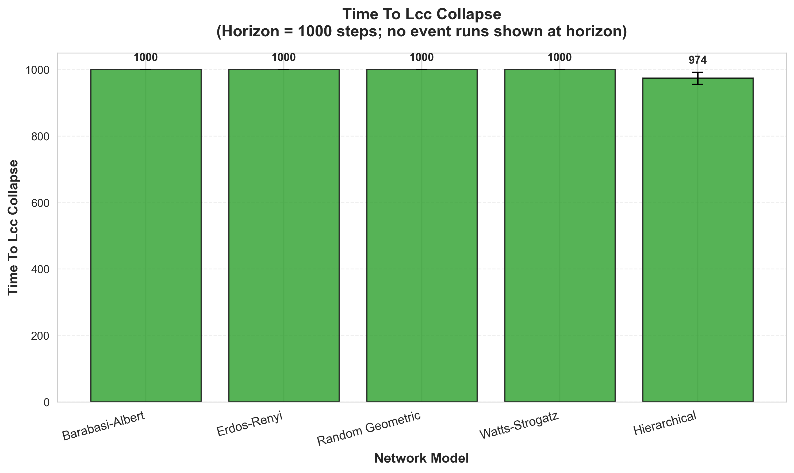
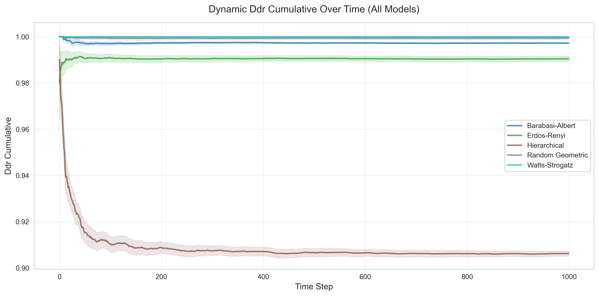

# Static Resilience Analysis: Results

## Plots

---

### Quantitative Resilience Metrics

**Time to 50% LCC Loss (Targeted Degree Attack):**

| Network Model | Nodes to 50% Loss | % of Total Nodes |
| :--- | :--- | :--- |
| Hierarchical | 10 | 3.3% |
| Barabási-Albert | 18 | 6% |
| Watts-Strogatz | 52 | 17% |
| Random Geometric | 48 | 16% |
| Erdős-Rényi | 95 | 32% |

**Vulnerability Index** (lower = more resilient):

| Network Model | Vulnerability Index |
| :--- | :--- |
| Hierarchical | 0.033 |
| Barabási-Albert | 0.060 |
| Watts-Strogatz | 0.173 |
| Random Geometric | 0.160 |
| Erdős-Rényi | 0.317 |
---

## Findings

### Barabási-Albert & Hierarchical Networks

- Observation: Targeted Degree and Targeted Centrality attacks are nearly identical and cause rapid collapse.
- Interpretation: Hubs/gateways are also key bridges; both strategies target the same critical nodes.

### Erdős-Rényi Network

- Observation: All three strategies behave similarly.
- Interpretation: The network is homogeneous; intelligent targeting offers little advantage.

### Watts-Strogatz & Random Geometric Networks

- Observation: Centrality-based attacks are most damaging, then degree-based, then random.
- Interpretation: High-centrality nodes form shortcuts/bridges across clusters or geographic regions.

---

> [!NOTE]
>
> Below we can view the summary table as a conclusion to the static analysis experiment.
>
> ### Summary Table
>
> | Network Model | Resilience to Random Failures | Most Effective Targeted Attack | Key Structural Reason |
> | :--- | :--- | :--- | :--- |
> | Hierarchical | Very High | Degree / Centrality (Identical) | Centralized single points of failure. |
> | Barabási-Albert | High | Degree / Centrality (Identical) | Hubs are also the main bridges. |
> | Watts-Strogatz | Moderate | Centrality | Attacks the critical "shortcut" nodes between clusters. |
> | Random Geometric | Moderate | Centrality | Attacks the critical "bridge" nodes between geographic regions. |
> | Erdős-Rényi | Moderate | (Similar) | Lacks exploitable structure. |
>

# Dynamic Resilience Analysis: Results

## Plots

---

### Performance Metrics Summary

**Data Delivery Ratio (DDR):**

| Network Model | Avg DDR | Performance |
| :--- | :--- | :--- |
| Watts-Strogatz | 1.0000 | Perfect ⭐⭐⭐⭐⭐ |
| Random Geometric | 0.9994 | Excellent ⭐⭐⭐⭐⭐ |
| Barabási-Albert | 0.9973 | Excellent ⭐⭐⭐⭐⭐ |
| Erdős-Rényi | 0.9905 | Very Good ⭐⭐⭐⭐ |
| Hierarchical | 0.9063 | Moderate ⭐⭐⭐ |

**Resilience to Random Failures:**

| Network Model | LCC Collapses | TTR Events | First Deaths |
| :--- | :--- | :--- | :--- |
| Watts-Strogatz | 0/150 (0%) | 0% | 0/150 |
| Random Geometric | 0/150 (0%) | 0% | 0/150 |
| Barabási-Albert | 0/150 (0%) | 0% | 0/150 |
| Erdős-Rényi | 0/150 (0%) | 0% | 0/150 |
| Hierarchical | 9/150 (6%) | 59% | 0/150 |

---

## Findings

### Watts-Strogatz & Random Geometric Networks

- **Observation:** Perfect or near-perfect packet delivery (DDR > 0.999). No LCC collapses.
- **Interpretation:** High clustering with shortcuts (WS) and spatial redundancy (RGG) provide excellent resilience to random failures. Multiple routing paths ensure continuous operation.

### Barabási-Albert Network

- **Observation:** Excellent DDR (0.9973). No collapses despite hub-based structure.
- **Interpretation:** Random failures rarely hit critical hubs (low probability). When non-hub nodes fail, connectivity maintained through hub redundancy.

### Erdős-Rényi Network

- **Observation:** Good DDR (0.9905). Predictable, homogeneous behavior.
- **Interpretation:** All nodes equally important. Random failures have moderate, uniform impact across the network.

### Hierarchical Network

- **Observation:** Significantly lower DDR (0.9063). 6% of runs experienced LCC collapse. 59% of runs had measurable disruptions (TTR > 0).
- **Interpretation:** Gateway nodes are single points of failure (6.6% random hit probability). When a gateway fails, ~14 connected sensors become isolated. Rapid recovery once gateway restored (TTR ≈ 0.31 steps).

---

> [!NOTE]
>
> ### Summary Table
>
> | Network Model | DDR Performance | Resilience to Random Failures | Resilience to Targeted Attacks | Key Characteristic |
> | :--- | :--- | :--- | :--- | :--- |
> | Watts-Strogatz | Perfect (1.0000) | Excellent | Moderate | Clustering + shortcuts |
> | Random Geometric | Excellent (0.9994) | Excellent | Moderate | Spatial redundancy |
> | Barabási-Albert | Excellent (0.9973) | Excellent | Poor | Hub-based, random-safe |
> | Erdős-Rényi | Very Good (0.9905) | Good | Moderate | Homogeneous structure |
> | Hierarchical | Moderate (0.9063) | Vulnerable | Extremely Vulnerable | Gateway dependency |
>

### Critical Insights

**1. Network Topology Matters More for Targeted Attacks**
- Random failures: Most topologies highly resilient (DDR > 99%)
- Targeted attacks: Hierarchical/BA collapse rapidly (see static analysis)
- Implication: Design choice depends on threat model

**2. Energy Model Validation**
- No nodes died from energy exhaustion in 1000 steps
- Topology effects visible, not masked by universal energy collapse
- Updated parameters (`initial_energy=100`, `base_energy_drain=0.03`) enable meaningful comparisons

**3. TTR Measurement: Zero is Good News**
- Most networks (BA, ER, WS, RGG) have TTR = 0
- Meaning: Single random failures don't cause ≥5% LCC degradation
- Only Hierarchical experiences measurable disruptions (centralized structure)

**4. Hierarchical Trade-offs**
- Advantages: Simple management, clear data flow, efficient routing
- Disadvantages: 10% packet loss, 6% collapse rate, gateway dependency
- Mitigation: Redundant gateways, multi-parent sensors, inter-gateway links

### Comparison: Static vs. Dynamic Analysis

| Network Model | Random Failures (Dynamic) | Targeted Attacks (Static) | Recommendation |
|---------------|---------------------------|---------------------------|----------------|
| Watts-Strogatz | Excellent (DDR=1.00) | Moderate (17% removal → 50% loss) | ✅ Best for high-reliability IoT |
| Random Geometric | Excellent (DDR=0.999) | Moderate (16% removal → 50% loss) | ✅ Best for spatial networks |
| Barabási-Albert | Excellent (DDR=0.997) | Poor (6% removal → 50% loss) | ⚠️ Use only if attacks unlikely |
| Erdős-Rényi | Good (DDR=0.991) | Moderate (32% removal → 50% loss) | ✅ Good baseline |
| Hierarchical | Vulnerable (DDR=0.906) | Extremely Poor (3.3% removal → 50% loss) | ❌ Avoid for critical systems |
